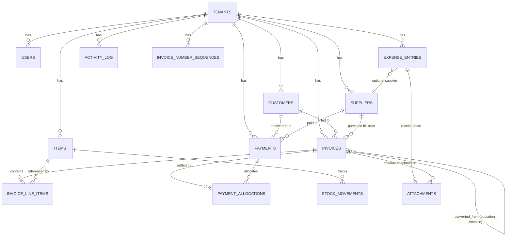

# Hisably — Entity Relationship Design (Phase 1)

All tables (except `tenants` itself) carry a `tenant_id` FK and are scoped through the
service/repository layer — never queried directly without it. All PKs are UUIDv4
(client-generatable for offline-first records). Money columns are `NUMERIC(12,2)`
in the tenant's currency (AED for launch). Every mutable business table has
`created_at`, `updated_at`; soft-void instead of delete for invoices/payments.

## Tables

### tenants
| column | type | notes |
|---|---|---|
| id | uuid pk | |
| business_name | text | |
| trn | text, nullable | UAE Tax Registration Number |
| vat_registered | bool | drives "Tax Invoice" vs "Invoice" rendering |
| country | enum(AE, SA, PK) | AE only in Phase 1, others reserved |
| currency | text | default `AED` |
| address | text | |
| logo_url | text, nullable | |
| invoice_prefix | text | e.g. `INV-` |
| default_vat_category | enum(standard, zero_rated, exempt) | default for new items |
| created_at / updated_at | timestamptz | |

### users
| column | type | notes |
|---|---|---|
| id | uuid pk | |
| tenant_id | uuid fk | |
| email | text unique | |
| password_hash | text | argon2 |
| role | enum(owner, staff) | |
| permissions | jsonb | `{can_view_reports, can_edit_items, can_record_payments, can_void_invoices, ...}` — only relevant for `staff` |
| email_verified_at | timestamptz, nullable | |
| otp_code_hash / otp_expires_at | text / timestamptz, nullable | for signup + future 2FA |
| created_at / updated_at | | |

### customers / suppliers
(identical shape, two tables to keep purchase vs sales semantics clean)
| column | type | notes |
|---|---|---|
| id | uuid pk | |
| tenant_id | uuid fk | |
| name / name_ar | text | |
| trn | text, nullable | |
| phone / email | text, nullable | |
| billing_address | text, nullable | |
| opening_balance | numeric(12,2) | signed; +ve = they owe us (customers) |
| credit_limit | numeric(12,2), nullable | customers only, ignored for suppliers |
| client_uuid | uuid, nullable | offline-created idempotency key |
| created_at / updated_at | | |

### items
| column | type | notes |
|---|---|---|
| id | uuid pk | |
| tenant_id | uuid fk | |
| name / name_ar | text | |
| sku | text, nullable | |
| unit | enum(pcs, sqm, sqft, kg, m, ...) | extensible string-backed enum |
| is_area_based | bool | if true, line items compute `qty = width × height` |
| sale_price / purchase_price | numeric(12,2) | |
| vat_category | enum(standard, zero_rated, exempt) | |
| track_inventory | bool | |
| current_stock | numeric(12,3), nullable | only if track_inventory |
| low_stock_threshold | numeric(12,3), nullable | |
| client_uuid | uuid, nullable | |
| created_at / updated_at | | |

### invoice_number_sequences
| column | type | notes |
|---|---|---|
| id | uuid pk | |
| tenant_id | uuid fk | |
| invoice_type | enum(tax_invoice, quotation, proforma, credit_note, purchase_bill) | independent counters per type |
| next_number | bigint | incremented atomically (`SELECT ... FOR UPDATE`) at sync/confirm time |

### invoices
| column | type | notes |
|---|---|---|
| id | uuid pk | client-generated, stable across offline/online |
| tenant_id | uuid fk | |
| type | enum(tax_invoice, quotation, proforma, credit_note, purchase_bill) | |
| status | enum(draft, sent, partially_paid, paid, overdue, void) | |
| customer_id | uuid fk, nullable | sales-side documents |
| supplier_id | uuid fk, nullable | `purchase_bill` only |
| invoice_number | text, nullable | server-assigned final number |
| draft_number | text | client-shown placeholder e.g. `DRAFT-7F3A` until synced |
| client_uuid | uuid | idempotency key for sync |
| issue_date / due_date | date | |
| currency | text | |
| exchange_rate | numeric(12,6) | snapshot, default 1 (multi-currency reserved) |
| subtotal / discount_total / vat_total / grand_total | numeric(12,2) | computed by shared invoice-math package |
| notes / terms | text, nullable | |
| pdf_template | enum(minimal, classic, bold) | |
| accent_color | text, nullable | per-invoice override of tenant default |
| language | enum(en, ar, bilingual) | |
| converted_from_id | uuid fk → invoices.id, nullable | quotation → invoice link |
| public_token | text unique, nullable | for tokenized public view |
| voided_at / void_reason | timestamptz / text, nullable | |
| created_at / updated_at | | |

### invoice_line_items
| column | type | notes |
|---|---|---|
| id | uuid pk | |
| invoice_id | uuid fk | |
| item_id | uuid fk, nullable | nullable = free-text line |
| description / description_ar | text | |
| quantity | numeric(12,3) | for area-based items, derived = width × height |
| width / height | numeric(12,3), nullable | |
| unit_price | numeric(12,2) | |
| discount_percent / discount_amount | numeric(12,2), nullable | one or the other |
| vat_category | enum(standard, zero_rated, exempt) | |
| vat_rate | numeric(5,2) | snapshot at time of invoicing |
| vat_amount / line_total | numeric(12,2) | computed |
| sort_order | int | |

### payments
| column | type | notes |
|---|---|---|
| id | uuid pk | |
| tenant_id | uuid fk | |
| customer_id / supplier_id | uuid fk, nullable | one or the other (or neither = on-account misc) |
| amount | numeric(12,2) | |
| method | enum(cash, bank_transfer, cheque, card, other) | |
| reference_no | text, nullable | |
| payment_date | date | |
| notes | text, nullable | |
| client_uuid | uuid | |
| created_at / updated_at | | |

### payment_allocations
| column | type | notes |
|---|---|---|
| id | uuid pk | |
| payment_id | uuid fk | |
| invoice_id | uuid fk | |
| amount_allocated | numeric(12,2) | sum across allocations ≤ payment.amount and ≤ invoice balance |

### expense_entries
| column | type | notes |
|---|---|---|
| id | uuid pk | |
| tenant_id | uuid fk | |
| category | text | free-form now, lookup table later |
| amount | numeric(12,2) | |
| vat_paid | numeric(12,2) | for input VAT in VAT201 |
| supplier_id | uuid fk, nullable | |
| expense_date | date | |
| attachment_id | uuid fk, nullable | |
| notes | text, nullable | |
| client_uuid | uuid | |
| created_at / updated_at | | |

### stock_movements
| column | type | notes |
|---|---|---|
| id | uuid pk | |
| tenant_id | uuid fk | |
| item_id | uuid fk | |
| qty_delta | numeric(12,3) | +/- |
| reason | enum(sale, purchase, adjustment, opening) | |
| reference_type / reference_id | text / uuid, nullable | polymorphic link to invoice etc. |
| created_at | | |

### activity_log
| column | type | notes |
|---|---|---|
| id | uuid pk | |
| tenant_id | uuid fk | |
| user_id | uuid fk | |
| entity_type / entity_id | text / uuid | |
| action | enum(created, edited, voided, payment_recorded, payment_allocated, ...) | |
| changes | jsonb | before/after diff |
| created_at | | |

### attachments
| column | type | notes |
|---|---|---|
| id | uuid pk | |
| tenant_id | uuid fk | |
| entity_type / entity_id | text / uuid | invoice, expense, etc. |
| file_url | text | local path in dev, S3/R2 key in prod |
| file_type | text | mime type |
| created_at | | |

### sync_log (server-side idempotency ledger)
| column | type | notes |
|---|---|---|
| id | uuid pk | |
| tenant_id | uuid fk | |
| client_uuid | uuid | the mutation's idempotency key |
| entity_type | text | |
| applied_at | timestamptz | |
| result_entity_id | uuid | what it resolved to |

> Unique constraint on `(tenant_id, client_uuid, entity_type)` — replaying a sync
> push with the same `client_uuid` is a no-op that returns the original result.

## Ledger logic
`customer.balance = opening_balance + Σ(sales invoices, grand_total, status != void) − Σ(payment_allocations against those invoices) − Σ(credit_note grand_total)`

Same formula mirrored for suppliers using `purchase_bill` instead of `tax_invoice`.

## Open questions for you
1. Do `customers` and `suppliers` ever overlap (same business is both a customer and a supplier)? If yes later, we may want a unified `parties` table with a type flag — flagging now so we don't paint ourselves into a corner, but proposing **separate tables for Phase 1** since it matches the spec and is simpler.
2. Confirm `invoice_number_sequences` is per `(tenant_id, invoice_type)` — i.e. quotations and tax invoices have independent numbering. This matches typical UAE practice but some businesses want one sequence for everything.
